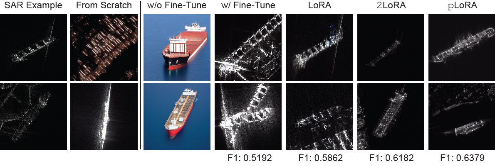

- [🧭 Introduction](#-introduction)
- [📝 Install](#-install)
    - [1. Build CLSAR](#1-build-clsar)
    - [2. Build GENSAR](#2-build-gensar)
    - [3. Build Inference API](#3-build-inference-api)
    - [4. Build ControlNet](#4-build-controlnet)
- [🌌 Datasets](#-datasets)
  - [Download and Install](#download-and-install)
- [📊 Reproduce Our Results](#-reproduce-our-results)
    - [1. SAR Example](#1-sar-example)
    - [2. From Scratch](#2-from-scratch)
    - [3. Fine-tuning](#3-fine-tuning)
    - [4. LoRA](#4-lora)
    - [5. 2LoRA](#5-2lora)
    - [6. pLoRA](#6-plora)


<div>
Code and datasets for the paper "Non-Visible Light Data Synthesis: a Case Study for Synthetic Aperture Radar Imagery" (more update pending).
</div>

# 🧭 Introduction

This code space contains three parts: 
* `./clsar`: Image **CL**assification pipeline for **SAR** ([Document of **CLSAR**](clsar/README.md)).
* `./gensar`: Image **GEN**eration pipeline for **SAR** ([Document of **GENSAR**](gensar/README.md)).
* `./datasets`: SAR ship classification dataset **FUSRS** and ORS ship dataset **DOSRS** ([direct link to **Datasets**](datasets/README.md)).

Please follow the instructions below to build the environments for GENSAR and CLSAR respectively, and download the datasets. After that, you can reproduce our results with our provided scripts.

# 📝 Install

Due to package conflicts, we build two seperate `conda` environments for GENSAR and CLSAR, respectively. Please follow the instructions below to build the environments.

### 1. Build CLSAR

Please refer [Document of **CLSAR**](clsar/README.md) for details.

1. Create a conda environment and activate it:

    ```bash
    # Install proper version of torch
    conda create -n clsar python=3.8 pytorch=1.10 cudatoolkit=11.3 torchvision==0.11.0 -c pytorch -y
    conda activate clsar
    ```
2. Then install MMCV and compile CLSAR:
    ```bash
    # Install mmcv package management tools
    pip3 install openmim
    mim install mmcv-full
    # Compile CLSAR folder as edit-able package
    cd ./clsar
    pip3 install -e .
    ```

Please refer to [MMClassification Install](https://mmclassification.readthedocs.io/en/latest/install.html) for more detailed installation.


### 2. Build GENSAR

GenSAR depends on [ControlNet](https://github.com/lllyasviel/ControlNet), the Huggingface [Diffusers](https://huggingface.co/docs/diffusers/index) and the [SDWebUI](https://github.com/AUTOMATIC1111/stable-diffusion-webui) as inference API. Torch version is torch2.1.0+cu118. 

Please refer [Document of **GENSAR**](gensar/README.md) for details.

1. **Conda Env with Torch 2.1**

    ```bash
    # Create a conda environment and activate it
    conda env create --name gensar python=3.9
    conda activate gensar
    # Install torch2.0.1+cu118
    conda install pytorch torchvision torchaudio pytorch-cuda=11.8 -c pytorch -c nvidia
    ```

2. **Install Huggingface Dependencies.** We recommand an editable install.

    ```bash
    # Compile diffusers from source
    cd gensar
    git clone https://github.com/huggingface/diffusers.git
    cd diffusers
    pip install -e ".[torch]"
    # (optional) xFormers for saving VRAM
    pip install xformers
    ```

### 3. Build Inference API
We employ SDWebUI API for quick batch inference. 

1. **Install and Start API backend.** We recommand an editable install.
    ```bash
    conda activate gensar
    # Install SDWebUI
    cd ./inference
    bash ./webui.sh
    ```


2. **Call API.** By default the API will listen on addr `localhost:7860`. You can call inference API the same in template `gensar/inference/scripts/inference/ors_sar_dosrscontour.py`.

    ```py
    # gensar/inference/scripts/inference/ors_sar_dosrscontour.py
    class ControlnetRequest:
        def __init__(self, url, prompt, path):
            self.url = url
            ...

        def build_body(self):
            self.body = {
                "prompt": self.prompt,
                "negative_prompt": "",
                ...
                "alwayson_scripts": {
                    "controlnet": {
                        "args": [
                            {
                                "enabled": True,
                                ...
                            }
                        ]
                    }
                },
            }
    ```

### 4. Build ControlNet

1. **Build ControlNet.** The `gensar/controlnet` branch is the same as in [original build](https://github.com/lllyasviel/ControlNet). Due to torch version conflict, we set a standalone environment for ControlNet. *Note in our implementation, fine-tuning controlnet is not necessary.* Directly employ pre-trained contour/segmentation ControlNet achieves same performance.

    ```bash
    cd ./controlnet
    conda env create -f environment.yaml
    conda activate ctrlnet
    ```

2. **(Optional) Train.** We provide training script in `gensar/controlnet/scripts/train.sh`:

    ```bash
    # Dataset is defined in gensar/controlnet/dataset_xxx.py
    python gensar/controlnet/scripts/train.py --batch_size 3 --gpus 4 --dataset fusrs_cam_v2 --ckpt_path ./checkpoints/xxx/
    ```

3. **Convert ControlNet for Inference.** To convert ControlNet resulting `.ckpt` (pyTorch Lightning checkpoint format) to `.pth` and deploy in Huggingface, we provide converting script in `gensar/controlnet/convert_ckpt_pth.py`. Please symbolink or save converted ControlNet weights in `gensar/inference/extensions/sd-webui-controlnet/models`.

# 🌌 Datasets

## Download and Install

We constructed two datasets, the [**FUSRS**](datasets/fusrs_v2/README.md) for SAR ship classification and the [**DOSRS**](datasets/dosrs_v1/README.md) for training ORS LoRA. Download links are provided in [Google Drive](https://drive.google.com/drive/folders/19qGGf4uEfNZmi5wIMzfXMYJkPtyXmyoo?usp=sharing). The datasets should be put in `./datasets` folder. The final folder structure should be like:

```
|-- clsar # image classification framework for SAR.
|-- datasets # our proposed datasets
|   |-- dosrs_v1 # ORS ship dataset
|   |-- fusrs_v2 # SAR ship dataset
|   `-- README.md
`-- gensar # image generation framework for SAR
    |-- controlnet # ControlNet for SAR
    |-- evaluation # KL and FID
    |-- finetune # train from Scratch or fine-tuning SD
    |-- gen_prompt # prompt construction
    |-- inference # inference pipeline
    `-- lora # ORS/SAR LoRA modules
```

Please refer [Document of **Datasets**](datasets/README.md) for more details.

# 📊 Reproduce Our Results


### 1. SAR Example

This is the raw SAR images from `./datasets/fusrs_v2/vgg_format/tanker`.

### 2. From Scratch
   
First please link the dataset into `./finetune/data/fusrs_v2`:
```bash
# Put the dataset
cd ./gensar/finetune
mkdir -p ./data/fusrs_v2
ln -s ../../datasets/fusrs_v2/hg_format ./data/fusrs_v2
```
We provide training scripts:
```bash
# Training from scratch
conda activate gensar
bash ./scripts/from_scratch.sh
# Inference
bash ./scripts/inf.sh
```
The resulting checkpoints are saved in `finetune/output/fusrs_v2/`. The generated images are saved in `finetune/output/gen/`.

### 3. Fine-tuning
   
First please follow the instruction in "From Scratch" to put the data. Then we provide fine-tuning scripts:
```bash
# Training from scratch
conda activate gensar
bash ./scripts/ft.sh
# Inference: please modify the checkpoint path
bash ./scripts/inf.sh
```
The resulting checkpoints are saved in `finetune/output/fusrs_v2/`. The generated images are saved in `finetune/output/gen/`.
### 4. LoRA

First please link the SAR dataset into `lora/data/fusrs_v2`:
```bash
# Put the SAR dataset
cd ./gensar/lora
mkdir -p ./data/fusrs_v2
ln -s ../../datasets/fusrs_v2/hg_format ./data/fusrs_v2
```
Train SAR LoRA:
```bash
# Training SAR LoRA
conda activate gensar
bash ./script_dgx/rank/256/256_fp32_s20000+100e_wp0_bs32_lr1e-03.sh
```

### 5. 2LoRA

First link the ORS dataset into `lora/data/fusrs_v2`:
```bash
# Put the ORS dataset
cd ./gensar/lora
mkdir -p ./data/dosrs_v1
ln -s ../../datasets/dosrs_v1/hg_format ./data/dosrs_v1
```
Train ORS LoRA:
```bash
# Training from scratch
conda activate gensar
bash ./script_dgx/train_dosrs.sh
```
The resulting LoRA module is in `lora/output/DOSRS_v1`

### 6. pLoRA
    
Please follow instructions above to put ORS and SAR data into`lora/data`. After that, the pLoRA training script is:
```bash
cd ./gensar/lora
conda activate gensar
bash ./script_dgx/cluster_lora/256/fusrs_clus_rank4_c4.sh
```
