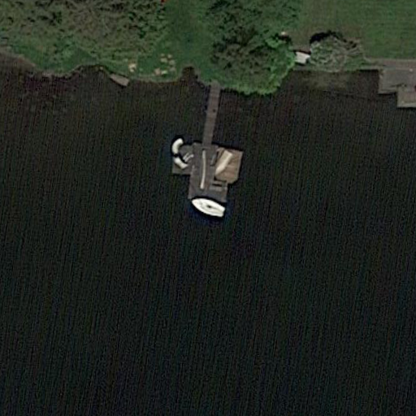

# DOSRS-v1.0
DOSRS_v1 combines DOTA_v2 and ShipRSImageNet datasets. It contains 53,101 images of size 512x512.

## DOTA_v2
DOTA_v2 is a large-scale dataset for object detection in aerial images. It is an extension of [DOTA_v1](https://captain-whu.github.io/DOTA/dataset.html) dataset. DOTA_v2 contains 2806 images with 188,282 instances, which are annotated by experts in aerial image interpretation. The images are collected from different sensors and platforms. The images are of different sizes and contain objects exhibiting a wide variety of scales, orientations, and shapes. The annotations of DOTA_v2 are more accurate and complete than DOTA_v1. DOTA_v2 is more suitable for developing and evaluating object detection algorithms in aerial images.

We only pickout the harbor and the ship instances from DOTA_v2 dataset to build DOSRS_v1. DOTA_v2 contains 498 images of ships and harbors (50,356 instances). I crop the ship instances from original image with **512x512** size patches with name `P{ImgIndex}_{PatchIndex}.png` (totally 50,356 images). The annotations for those image patches are saved in `./meta/annotation.jsonl` in `.jsonl` format. Especially, we insert the rare tokens "ORS", "optical remote sensing" and "ship"/"harbor" into prompt, and didn't include any other class-agnostic prompts (*i.e.* general features that is not corresponds to current image like big ship, black ship).

## ShipRSImageNet
ShipRSImageNet got 3,439 high-resolution optical remote sensing images, each containing 1-10 ship instances. ShipRSImageNet only got detection annotation in `.xml` format (under `ShipRSImageNet/VOC_Format/Annotations`), so I use GPT-4 to extract key information and generate prompts, based on ship type, ship size and correlation between ships. The corresponding generation script is saved in `/workspace/data/shiprsimagenet/ShipRSImageNet/script/gen_prompt_retry_failed.ipynb`.

All ShipRSImageNet images are ending with `.bmp`. The size is variant (but will be resized to **512x512** in LoRA training).

In this dataset, we are not using ship patches, but use the high-res whole image instead. We generate the visual relationships between different ship instances. Thus one image may contain multiple ship instances:

